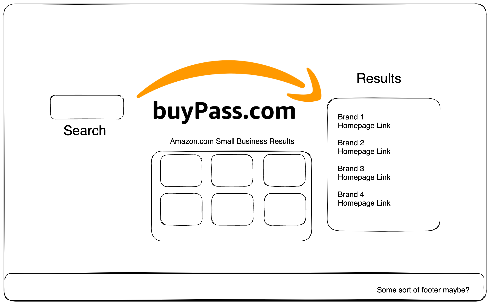

# Project Overview

## Project Name: "Buy Pass"
buy-pass.vercel.app

## Project Description
Filters Amazon search results for small businesses, then provides user with direct links to company websites.

## API and Data Sample

Rainforest API - https://www.rainforestapi.com/ (paid)
<br>Google Custom Search JSON API - https://developers.google.com/custom-search/v1

Rainforest:
```js
async function amazonSearch (searchTerm) {
  const res = await fetch(`${params}&type=search&search_term=${searchTerm}`);
  const json = await res.json();
  return json.search_results;
}
```

Google:
```js
async function googleSearch(term, number) {
  const res = await fetch(`${googleURL}?q=${term}&cx=${customSearch}&key=${googleAPI}&num=${number}`)
  const json = await res.json();
  return json.items;
}
```

## Wireframes

Upload images of your wireframes to an image hosting site or add them to an assets folder in your repo and link them here with a description of each specific wireframe.

> 
> Made with excalidraw.com*

### MVP/PostMVP

#### MVP 

- Find and use external api (Rainforest, which mirrors Amazon)
- Filter results for small businesses
- Render data on page 

#### PostMVP  

- Perform Google Search for small business name
- Filter results to find business' home page
- Provide user with link to page
